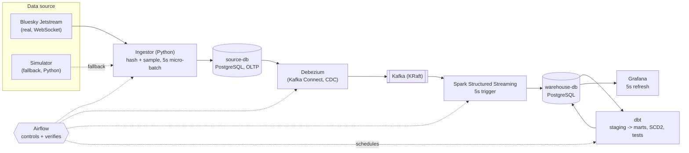

# Bluesky Real-Time Activity Platform

A real-time data engineering pipeline that ingests the public **Bluesky
Jetstream** feed and turns it into a live analytics dashboard: activity
trends, trending hashtags, user segments and bot-like account detection -
all refreshed every 5 seconds.

> Current status: **Stage 6 - dbt.** `make run-dbt` (DAG 04) builds
> staging -> intermediate -> marts on a schedule: a rule-based user segment
> with full SCD2 history, trending hashtags, engagement, and a rule-based
> anomalous-accounts mart - all tested (unique/not_null/accepted_values/
> relationships) and documented in dbt docs. Grafana is still a
> placeholder, built in Stage 7. See `docs/PROJECT_PLAN.md` section 8 for
> the full roadmap.

## Purpose

Bluesky publishes every public action on the platform (posts, likes,
reposts, follows, blocks, profile updates) in real time through
**Jetstream**, a free WebSocket feed that needs no API key. This project
samples that feed, anonymizes it, and pipes it through a real CDC +
streaming + warehouse stack so that Growth/Product, Content and Trust &
Safety teams could each answer their own question from one Grafana
dashboard. See `docs/PROJECT_PLAN.md` for the full problem statement.

## Architecture



An action on Bluesky is expected to appear in Grafana within 5-10 seconds.
Airflow is off the data path - it only starts/stops components, runs dbt
on a schedule, and verifies each step (see `docs/PROJECT_PLAN.md` section 6).

## Tech stack

Python, PostgreSQL, Debezium, Kafka (KRaft), Spark Structured Streaming,
dbt, Airflow, Grafana, Docker Compose, and Kafka UI as an auxiliary
monitor. Full reasoning and rejected alternatives for each tool are in
`docs/PROJECT_PLAN.md` section 4.

## Prerequisites

- Docker Engine and the Docker Compose plugin
- `git`, `make`
- 16 GB RAM recommended, 30 GB free disk
- Outbound access on port 443 (to reach Jetstream)

## Setup

```bash
git clone <repo-url>
cd bluesky-activity-data-platform
make env      # creates .env from .env.example - edit the salt/passwords
make venv     # optional: local Python env for editing and running tests
make up       # builds and starts every service (from Stage 2 onward)
make health   # confirms every service is healthy
```

## Running the pipeline stage by stage

Each stage can be started independently, from Airflow or with `make`, and
its result inspected in its own UI. See `docs/RUNBOOK.md` for the full
scenario with expected before/after states, and `docs/DEMO.md` for a
presentation script.

```bash
make start-ingestion   # DAG 01 - real Bluesky events start flowing
make start-cdc         # DAG 02 - CDC into Kafka
make start-spark       # DAG 03 - Spark streaming into the warehouse
make run-dbt           # DAG 04 - staging/marts built and tested
make stop-ingestion    # DAG 05 - stop the flow
make reset-demo        # DAG 99 - wipe everything for a clean re-run
```

## Stopping / cleaning up

```bash
make down     # stop everything, keep data
make restart  # stop and start again, data persists
make clean    # stop everything AND delete all volumes
```

## UI links

All ports are bound to `127.0.0.1` only; access them through an SSH tunnel
when running on a remote server (see below). Run `make urls` to print this
list at any time.

| Service | Link |
|---|---|
| Ingestor status | <http://localhost:8000/docs> |
| Simulator | <http://localhost:8001/docs> |
| Kafka UI | <http://localhost:8085> |
| Debezium (Kafka Connect) | <http://localhost:8083/connectors> |
| Spark Master | <http://localhost:8080> |
| Spark Streaming | <http://localhost:4040> |
| Airflow | <http://localhost:8081> |
| dbt docs | <http://localhost:8088> |
| Grafana | <http://localhost:3000> |
| source-db | localhost:5432 |
| warehouse-db | localhost:5433 |

## Running on a remote server

This project is designed to run on a remote Linux server, accessed over
SSH, with every UI reached through an SSH tunnel.

**Connect:**

```bash
ssh <user>@<remote-host>
```

**Open a tunnel for every UI port** (also printed by `make tunnel`):

```bash
ssh -N -L 8000:localhost:8000 -L 8001:localhost:8001 -L 8085:localhost:8085 \
    -L 8083:localhost:8083 -L 8080:localhost:8080 -L 4040:localhost:4040 \
    -L 8081:localhost:8081 -L 8088:localhost:8088 -L 3000:localhost:3000 \
    -L 5432:localhost:5432 -L 5433:localhost:5433 <user>@<remote-host>
```

**`~/.ssh/config` example**, so you can just run `ssh bluesky-server`:

```
Host bluesky-server
    HostName <remote-host>
    User <user>
    LocalForward 8000 localhost:8000
    LocalForward 8001 localhost:8001
    LocalForward 8085 localhost:8085
    LocalForward 8083 localhost:8083
    LocalForward 8080 localhost:8080
    LocalForward 4040 localhost:4040
    LocalForward 8081 localhost:8081
    LocalForward 8088 localhost:8088
    LocalForward 3000 localhost:3000
    LocalForward 5432 localhost:5432
    LocalForward 5433 localhost:5433
```

**VS Code Remote-SSH:** if you open this folder with the Remote-SSH
extension, it detects the ports the services listen on and forwards them
automatically - no manual tunnel command needed.

**tmux tip:** run `make up` inside a `tmux` session (`tmux new -s bluesky`)
so the stack keeps running after you disconnect; reattach later with
`tmux attach -t bluesky`.

## Directory structure

```
bluesky-activity-data-platform/
├── docs/            Project plan, runbook, demo script, privacy notes
├── config/          Shared, non-secret settings (Jetstream hosts, sampling, intervals)
├── requirements/    Pinned Python dependencies, one file per component
├── ingestion/       Ingestor (real Jetstream client) and simulator (fallback)
├── streaming/       Spark Structured Streaming job (Kafka -> warehouse)
├── transformation/  dbt project: staging, intermediate, snapshots, marts
├── orchestration/   Airflow DAGs that start/stop stages and run dbt
├── serving/         Grafana provisioning (datasources, dashboards)
├── infra/           Dockerfiles and Postgres init scripts
├── scripts/         Operational shell scripts (health, connector, status, reset)
└── tests/           Unit tests for parsing, privacy, cleaning logic
```

Every top-level directory maps to one section of `docs/PROJECT_PLAN.md`
section 3 (target architecture) - see that document for why each
component exists.

## Privacy

No password, login, IP address, device ID, handle, display name, avatar or
post text is ever stored. User identifiers are salted-hashed before they
touch any database. Full details in `docs/PRIVACY.md`.

## Data source attribution

Real-time data is read from **Bluesky Jetstream**
(<https://github.com/bluesky-social/jetstream>), a public feed operated by
Bluesky. This project only reads already-public data at a sampled rate and
does not republish any content.
