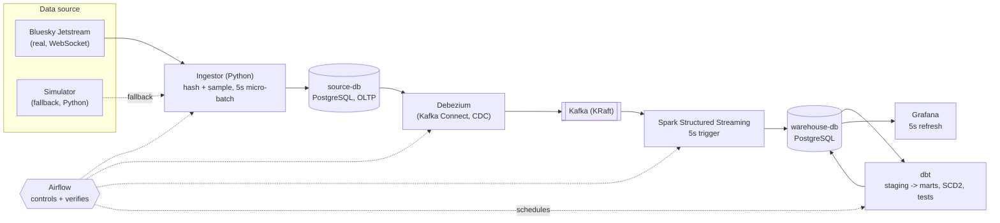

# Bluesky Real-Time Activity Platform

A real-time data engineering pipeline that ingests the public **Bluesky
Jetstream** feed and turns it into a live analytics dashboard: activity
trends, trending hashtags, user segments and bot-like account detection -
all refreshed every 5 seconds.

> Current status: **All 8 stages complete.** The full pipeline runs end to
> end: real Bluesky Jetstream ingestion, CDC via Debezium, Spark
> Structured Streaming, dbt marts with SCD2 history, a live Grafana
> dashboard, daily retention, and a one-command demo reset. 34 unit tests
> and `ruff` pass. See `docs/PROJECT_PLAN.md` section 8 for how each stage
> was built and `docs/RUNBOOK.md` for the step-by-step verification
> scenario.

## Purpose

Bluesky publishes every public action on the platform (posts, likes,
reposts, follows, blocks, profile updates) in real time through
**Jetstream**, a free WebSocket feed that needs no API key. This project
samples that feed, anonymizes it, and pipes it through a real CDC +
streaming + warehouse stack so that Growth/Product, Content and Trust &
Safety teams could each answer their own question from one Grafana
dashboard. See `docs/PROJECT_PLAN.md` for the full problem statement.

## Architecture



An action on Bluesky is expected to appear in Grafana within 5-10 seconds.
Airflow is off the data path - it only starts/stops components, runs dbt
on a schedule, and verifies each step (see `docs/PROJECT_PLAN.md` section 6).

**Implementation status: every component above is fully implemented** (all
8 build stages complete, verified against real Bluesky data on a live
server - see `docs/PROJECT_PLAN.md` section 8). The diagram has nothing
"planned but not built". One addition sits outside this diagram: DAG
`07_daily_batch_report`, a separate batch/logical-date slice added for
Phase 1 compliance - see `docs/decisions/0001-streaming-vs-batch-architecture.md`.

## Tech stack

Python, PostgreSQL, Debezium, Kafka (KRaft), Spark Structured Streaming,
dbt, Airflow, Grafana, Docker Compose, and Kafka UI as an auxiliary
monitor. Full reasoning and rejected alternatives for each tool are in
`docs/PROJECT_PLAN.md` section 4.

**Component-role mapping:**

| Component | Role |
|---|---|
| Bluesky Jetstream | Real data source: posts, likes, reposts, follows, blocks, profile updates, deletions |
| Python - Ingestor | Reads Jetstream, hashes/samples users, writes to source-db every 5s |
| Python - Simulator | Fallback data source, same shape as Jetstream |
| PostgreSQL - source-db | Operational (OLTP) database; logical replication enabled |
| Debezium (Kafka Connect) | Streams source-db inserts/updates/deletes to Kafka (CDC) |
| Kafka (KRaft) | Durable log between Debezium and Spark |
| Spark Structured Streaming | 5s trigger: cleans, quarantines, upserts into the warehouse, computes real-time aggregates |
| PostgreSQL - warehouse-db | Analytical database (raw/realtime/staging/marts/dq/control) |
| dbt | Staging, SCD2 snapshots, marts, tests |
| Airflow | Starts/stops stages, runs dbt on a schedule, verifies each step, runs the Phase 1 batch DAG |
| Grafana | Live dashboard, 5s refresh, provisioned automatically |
| Docker Compose | Runs and networks every service |
| Kafka UI | Auxiliary Kafka monitoring |

## Prerequisites

- Docker Engine and the Docker Compose plugin
- `git`, `make`
- 16 GB RAM recommended, 30 GB free disk
- Outbound access on port 443 (to reach Jetstream)

## Setup

```bash
git clone <repo-url>
cd bluesky-activity-data-platform
make env      # creates .env from .env.example - edit the salt/passwords
make venv     # optional: local Python env for editing and running tests
make up       # builds and starts every service (from Stage 2 onward)
make health   # confirms every service is healthy
```

## Running the pipeline stage by stage

Each stage can be started independently, from Airflow or with `make`, and
its result inspected in its own UI. See `docs/RUNBOOK.md` for the full
scenario with expected before/after states, and `docs/DEMO.md` for a
presentation script.

```bash
make start-ingestion   # DAG 01 - real Bluesky events start flowing
make start-cdc         # DAG 02 - CDC into Kafka
make start-spark       # DAG 03 - Spark streaming into the warehouse
make run-dbt           # DAG 04 - staging/marts built and tested
make stop-ingestion    # DAG 05 - stop the flow
make reset-demo        # DAG 99 - wipe everything for a clean re-run
```

## Phase 1 additions: batch slice, smoke test, CI, deliberate failure

On top of the continuous streaming pipeline above, this project also
includes a genuinely **batch**, logical-date-parameterized slice and the
supporting checks a Phase 1 "walking skeleton" review expects. See
`docs/decisions/0001-streaming-vs-batch-architecture.md` for why these
are kept separate from the streaming DAGs rather than bolted onto them.

**Run the batch pipeline for a specific day:**
```bash
# Today's date (default):
docker compose exec airflow-scheduler airflow dags trigger 07_daily_batch_report

# An arbitrary historical date:
docker compose exec airflow-scheduler airflow dags trigger 07_daily_batch_report --exec-date 2026-09-25
```
This computes one row of `marts.mart_daily_summary` (delete-then-insert,
keyed by `report_date`) from `marts.fct_user_daily_activity`. Running it
twice for the same date never duplicates; running it for a different date
never overwrites the first.

**Verify every layer with the smoke test** (needs the stack up and DAGs
01-04 and 07 having run at least once for today):
```bash
make smoke
```
Prints row counts for `raw.posts`, `staging.stg_posts`, `marts.fct_posts`
and today's `marts.mart_daily_summary` row, and confirms Grafana
(`localhost:3000/api/health`) is reachable. See `docs/evidence/phase-1.md`
for a captured run.

**Prove Kafka itself is reachable** (independent of Debezium/Spark):
```bash
make kafka-test
```

**Trigger a deliberate failure** (to see failure propagation in Airflow):
```bash
docker compose exec -e FORCE_INGESTION_FAILURE=true airflow-scheduler \
    airflow dags test 01_start_ingestion
```
`enable_ingestion` raises on purpose; `check_source_db_growth` then shows
`upstream_failed` and the whole run is marked `failed` in the Airflow UI.

**Where to find logs:** every Airflow task's stdout/stderr is in the
Airflow UI (click into a run → a task → "Logs"), or on disk inside the
`airflow-scheduler` container under
`/opt/airflow/logs/dag_id=<dag>/run_id=<run>/task_id=<task>/attempt=<n>.log`.
Long-running service logs (ingestor, Spark, etc.) are in `docker compose
logs <service>`.

**CI:** every pull request runs lint (`ruff`), a compile check of every
pipeline module, the unit test suite, and `docker compose config`
validation - see `.github/workflows/ci.yml`.

## Stopping / cleaning up

```bash
make down     # stop everything, keep data
make restart  # stop and start again, data persists
make clean    # stop everything AND delete all volumes
```

## All Makefile targets

The commands above cover the common path; every target also works on its
own:

| Target | What it does |
|---|---|
| `make env` | Create `.env` from `.env.example` (never overwrites) |
| `make venv` | Create a local Python virtual environment with all dependencies |
| `make up` | Build and start every service |
| `make up-infra` | Start only the databases and Kafka |
| `make up-stream` | Start only Kafka Connect, ingestor, simulator and Spark |
| `make up-orchestration` | Start only Airflow |
| `make up-serving` | Start only Grafana and dbt-docs |
| `make down` | Stop everything, keep data |
| `make restart` | Stop and start again, data persists |
| `make clean` | Stop everything **and delete all volumes** |
| `make ps` | Show service status (`docker compose ps`) |
| `make health` | Run `scripts/check_health.sh` |
| `make status` | Run `scripts/pipeline_status.sh` (row counts per layer, every 5s) |
| `make logs service=<name>` | Tail one service's logs |
| `make urls` | Print every UI link |
| `make tunnel` | Print the SSH tunnel command with every port |
| `make start-ingestion` / `make stop-ingestion` | DAG 01 / DAG 05 |
| `make start-cdc` | DAG 02 |
| `make start-spark` | DAG 03 |
| `make run-dbt` | DAG 04 |
| `make reset-demo` | Run `scripts/reset_demo.sh` (host-side equivalent of DAG 99) |
| `make test` | Run the pytest suite (excludes `tests/smoke`) |
| `make lint` | Run `ruff check .` |
| `make smoke` | Run the Phase 1 integration smoke test against the real running stack |
| `make kafka-test` | Round-trip a message through Kafka to prove connectivity |

## UI links

All ports are bound to `127.0.0.1` only; access them through an SSH tunnel
when running on a remote server (see below). Run `make urls` to print this
list at any time.

| Service | Link |
|---|---|
| Ingestor status | <http://localhost:8000/docs> |
| Simulator | <http://localhost:8001/docs> |
| Kafka UI | <http://localhost:8085> |
| Debezium (Kafka Connect) | <http://localhost:8083/connectors> |
| Spark Master | <http://localhost:8080> |
| Spark Streaming | <http://localhost:4040> |
| Airflow | <http://localhost:8081> |
| dbt docs | <http://localhost:8088> |
| Grafana | <http://localhost:3000> |
| source-db | localhost:5432 |
| warehouse-db | localhost:5433 |

## Running on a remote server

This project is designed to run on a remote Linux server, accessed over
SSH, with every UI reached through an SSH tunnel.

**Connect:**

```bash
ssh <user>@<remote-host>
```

**Open a tunnel for every UI port** (also printed by `make tunnel`):

```bash
ssh -N -L 8000:localhost:8000 -L 8001:localhost:8001 -L 8085:localhost:8085 \
    -L 8083:localhost:8083 -L 8080:localhost:8080 -L 4040:localhost:4040 \
    -L 8081:localhost:8081 -L 8088:localhost:8088 -L 3000:localhost:3000 \
    -L 5432:localhost:5432 -L 5433:localhost:5433 <user>@<remote-host>
```

**`~/.ssh/config` example**, so you can just run `ssh bluesky-server`:

```
Host bluesky-server
    HostName <remote-host>
    User <user>
    LocalForward 8000 localhost:8000
    LocalForward 8001 localhost:8001
    LocalForward 8085 localhost:8085
    LocalForward 8083 localhost:8083
    LocalForward 8080 localhost:8080
    LocalForward 4040 localhost:4040
    LocalForward 8081 localhost:8081
    LocalForward 8088 localhost:8088
    LocalForward 3000 localhost:3000
    LocalForward 5432 localhost:5432
    LocalForward 5433 localhost:5433
```

**VS Code Remote-SSH:** if you open this folder with the Remote-SSH
extension, it detects the ports the services listen on and forwards them
automatically - no manual tunnel command needed.

**tmux tip:** run `make up` inside a `tmux` session (`tmux new -s bluesky`)
so the stack keeps running after you disconnect; reattach later with
`tmux attach -t bluesky`.

## Directory structure

```
bluesky-activity-data-platform/
├── docs/            Project plan, runbook, demo script, privacy notes
├── config/          Shared, non-secret settings (Jetstream hosts, sampling, intervals)
├── requirements/    Pinned Python dependencies, one file per component
├── ingestion/       Ingestor (real Jetstream client) and simulator (fallback)
├── streaming/       Spark Structured Streaming job (Kafka -> warehouse)
├── transformation/  dbt project: staging, intermediate, snapshots, marts
├── orchestration/   Airflow DAGs that start/stop stages and run dbt
├── serving/         Grafana provisioning (datasources, dashboards)
├── infra/           Dockerfiles and Postgres init scripts
├── scripts/         Operational shell scripts (health, connector, status, reset)
└── tests/           Unit tests for parsing, privacy, cleaning logic
```

Every top-level directory maps to one section of `docs/PROJECT_PLAN.md`
section 3 (target architecture) - see that document for why each
component exists.

## Privacy

No password, login, IP address, device ID, handle, display name, avatar or
post text is ever stored. User identifiers are salted-hashed before they
touch any database. Full details in `docs/PRIVACY.md`.

## Data source attribution

Real-time data is read from **Bluesky Jetstream**
(<https://github.com/bluesky-social/jetstream>), a public feed operated by
Bluesky. This project only reads already-public data at a sampled rate and
does not republish any content.
