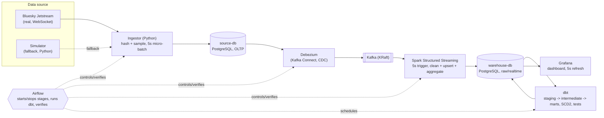

# Project Plan - Bluesky Real-Time Activity Platform

## 1. Problem statement

**Domain:** Social media - Bluesky user activity analytics.

**Business question:** How does user activity on Bluesky change over time,
which topics and content drive the most engagement, and which accounts
behave anomalously (bot-like)?

**Consumers and the decisions they make from this data:**

| Consumer | What they see | Decision supported |
|---|---|---|
| Growth / Product | Activity trends, user segments | Which segment to target with which feature or notification |
| Content | Trending hashtags, languages, most engaging posts | What to recommend |
| Trust & Safety | Anomalous accounts (hundreds of follows/likes per minute, mass deletions) | Which accounts to review |

**Out of scope:** logins, passwords, IP addresses, devices, or any private
access data. Only actions the platform already publishes publicly are
used - see `docs/PRIVACY.md`.

## 2. Data sources

### Bluesky Jetstream (primary, real data)

- **What it is:** a public, real-time WebSocket stream of every action
  taken on Bluesky (posts, likes, reposts, follows, blocks, profile
  updates, deletions), maintained by Bluesky. No API key or account is
  required to read it.
- **Official public hosts** (verified against
  <https://github.com/bluesky-social/jetstream>):
  - `wss://jetstream1.us-east.bsky.network/subscribe`
  - `wss://jetstream2.us-east.bsky.network/subscribe`
  - `wss://jetstream1.us-west.bsky.network/subscribe`
  - `wss://jetstream2.us-west.bsky.network/subscribe`
- **Format:** one JSON object per message. Example commit event (a new
  like), taken from the official docs:
  ```json
  {
    "did": "did:plc:q6gjnaw2blty4crticxkmujt",
    "time_us": 1725911162329308,
    "kind": "commit",
    "commit": {
      "rev": "3l3qo2vutsw2b",
      "operation": "create",
      "collection": "app.bsky.feed.like",
      "rkey": "3l3qo2vuowo2b",
      "cid": "bafyreid...",
      "record": { "$type": "app.bsky.feed.like", "...": "..." }
    }
  }
  ```
  `kind` can also be `identity` or `account`, each with a matching object
  instead of `commit`. `operation` is `create`, `update` or `delete`;
  `record`/`cid` are absent on `delete`.
- **Server-side filtering:** the `wantedCollections` query parameter (one
  per collection, repeatable) tells Jetstream to only send us the
  collections we track, instead of the entire firehose:

  | Tracked event | Jetstream collection (NSID) |
  |---|---|
  | post | `app.bsky.feed.post` |
  | like | `app.bsky.feed.like` |
  | repost | `app.bsky.feed.repost` |
  | follow | `app.bsky.graph.follow` |
  | block | `app.bsky.graph.block` |
  | profile update | `app.bsky.actor.profile` |

- **Resuming:** `?cursor=<time_us>` resumes the stream a few seconds
  before the last cursor we saved, so a restart never silently skips
  events (duplicates are then dropped in `source-db` via unique keys).
- **Volume estimate:** the full firehose is large (hundreds of events per
  second network-wide); after filtering to our six collections and
  applying `SAMPLING_RATE` (default 10% of users, all of their events),
  we expect a manageable, steady trickle suitable for a single small
  server.
- **Known quality issues we must handle downstream:**
  - Timestamps are client-set at the source and can occasionally be
    wrong (future or very old) - handled by Spark validation
    (`dq.quarantine`).
  - Reconnecting after a drop can redeliver events we already saw -
    handled by unique keys / idempotent upserts at every layer.
  - A `like` or `repost` can reference a post we never sampled (its
    author wasn't in our 10%) - handled as a `dbt` relationship warning,
    not a hard failure.
  - Schema drift: Bluesky can add new record fields at any time - the
    parser only reads the fields it knows and ignores the rest.
  - Language is not always present on a post - stored as `unknown`
    rather than failing the row.

### Simulator (fallback data)

When `SOURCE_MODE=simulator`, `ingestion/simulator/generator.py` produces
events in the exact same JSON shape as Jetstream, so every downstream
component is unaware of which source is active. It additionally injects,
at configurable rates (`config/settings.yaml`):
missing fields, duplicate events, future timestamps, unknown event types,
a schema-drift field introduced after a configured delay, and bot-like
accounts that generate hundreds of follows/likes per minute. This keeps
the pipeline demoable even if Jetstream is unreachable, and gives Spark's
data-quality logic real bad data to catch.

## 3. Target architecture



**Why each component exists:**

- **Ingestor:** the only component that talks to the outside world; keeps
  privacy (hashing) and sampling logic in one place, at the edge.
- **source-db:** a normal OLTP database, so the ingestor writes with plain
  SQL and Debezium can read its write-ahead log - mirrors how a real
  production app and CDC pipeline are wired together.
- **Debezium + Kafka:** captures every insert/update/**delete** without
  the ingestor needing to know Kafka exists; decouples ingestion from
  streaming.
- **Spark Structured Streaming:** the one place that cleans, deduplicates
  and quarantines bad data before it reaches the warehouse, and computes
  cheap per-minute aggregates for the "real-time" feel.
- **warehouse-db:** kept separate from `source-db` so heavy analytical
  queries (dbt, Grafana) never compete with OLTP writes.
- **dbt:** all business logic (segments, SCD2 history, marts) lives here
  as testable, versioned SQL instead of scattered scripts.
- **Airflow:** batch-oriented control plane - flips switches, runs dbt on
  a schedule, and verifies each step, but is deliberately kept off the
  low-latency streaming path (see section 6).
- **Grafana:** the single pane of glass all three consumer groups look
  at, refreshing every 5 seconds.

## 4. Tech stack

| Tool | Reason | Rejected alternative |
|---|---|---|
| Bluesky Jetstream | Pre-filtered, JSON, lightweight, official and free | The full firehose (`com.atproto.sync.subscribeRepos`) - rejected because it is binary CBOR/CAR and considerably more complex to parse for this project's scope |
| Python (ingestor/simulator) | Simple async WebSocket + DB code, matches the course's tooling | A managed connector - rejected, we need custom hashing/sampling logic anyway |
| PostgreSQL (source-db) | Logical replication built in, well understood, free | MySQL - rejected, team is more familiar with Postgres and its replication slots |
| Debezium | Captures deletes and is decoupled from the app; mirrors real CDC pipelines | Ingestor writing directly to Kafka - rejected because it would need to reimplement delete-capture and would couple ingestion to Kafka's availability |
| Kafka (KRaft mode) | Industry-standard durable log; no ZooKeeper to operate (KRaft) | A simple message queue (e.g. Redis) - rejected, lacks Kafka Connect's CDC ecosystem |
| Spark Structured Streaming | Native micro-batch triggers (5s), scales, one engine for cleaning + aggregation | Writing a custom Kafka consumer in Python - rejected, would reimplement checkpointing/exactly-once semantics that Spark already provides |
| PostgreSQL (warehouse-db) | Same engine as source-db, simpler ops, dbt-postgres is mature | A columnar warehouse (e.g. ClickHouse) - rejected as out of scope per the allowed tool list |
| dbt | SQL-native transformations, built-in testing and SCD2 snapshots | Hand-written transformation scripts - rejected, no built-in testing/lineage |
| Airflow | Standard scheduler/orchestrator, DAG-based, good UI for the defense | Cron scripts - rejected, no retry/backfill/UI/observability |
| Grafana | Sub-5-second refresh, free, provisioning-as-code | Metabase - rejected because its fastest refresh is 1 minute, too slow for the 5-10s latency requirement |
| Docker Compose | Single-command, reproducible multi-service setup on one server | Kubernetes - rejected as overkill for a single-server course project |
| Kafka UI | Free, lets us visually confirm CDC messages during development/defense | None needed - explicitly allowed as an auxiliary monitoring tool |

## 5. Data model

```
Jetstream / Simulator
        |
        v
source-db (OLTP)          users, posts, likes, reposts, follows, blocks,
                           profile_updates, ingestion_cursor
        |  (Debezium CDC)
        v
raw (warehouse)            1:1 copy of source-db rows + lineage columns
                           (kafka offset, op, ingestion time)
        |  (dbt staging)
        v
staging                    typed, deduplicated, one row per source row
        |
        v
intermediate                user x day activity
        |
        v
snapshots                   dim_user SCD2 (segment + main language history)
        |
        v
marts                        dim_user, dim_date, dim_hashtag, dim_language,
                             fct_posts, fct_interactions, fct_user_daily_activity,
                             mart_engagement, mart_trending_hashtags,
                             mart_anomalous_accounts
```

**Grain and keys:**

- `fct_posts` - one row per post; primary key = post's hashed record key.
- `fct_interactions` - one row per action (like/repost/reply/follow/block);
  built **incrementally** with a unique key of
  (hashed user id, action type, target record key) and a lookback window
  (e.g. last 2 hours reprocessed) to absorb late-arriving events.
- `fct_user_daily_activity` - one row per (hashed user id, date).
- `dim_user` - **SCD2**: a new row is added whenever a user's segment
  (creator/engager/lurker) or main language changes, with
  `valid_from`/`valid_to`/`is_current` columns; exactly one current row
  per user is enforced by a dbt test.

**Incremental strategy:** `raw` is upserted by Spark on every 5-second
micro-batch (idempotent, keyed by the source row's primary key). dbt
models that read from `raw` run incrementally on a schedule (`04_dbt_transform`,
every `DBT_RUN_INTERVAL_MINUTES`), reprocessing only new/changed rows plus
a lookback window for `fct_interactions`.

## 6. Pipeline design

- **Streaming part:** Ingestor -> source-db -> Debezium -> Kafka -> Spark
  -> warehouse `raw`/`realtime`. Runs continuously, 5-second cadence
  end-to-end.
- **Batch part:** dbt (`staging` -> `intermediate` -> `snapshots` ->
  `marts`), scheduled every `DBT_RUN_INTERVAL_MINUTES` (default 5) minutes
  by Airflow.
- **Why streaming does not run inside Airflow:** Airflow schedules
  discrete task runs with a start and an end; a Spark Structured Streaming
  query is a single long-running process that must keep its own
  checkpoint alive continuously. Airflow's job here is limited to flipping
  a switch (`control.pipeline_switches.spark_enabled`) that
  `streaming/launcher.sh` polls, and then verifying the result - not
  supervising the streaming query itself.
- **Idempotency, end to end:**
  - Ingestor: resumes from the saved `time_us` cursor; unique keys in
    `source-db` absorb any events redelivered by Jetstream after a
    reconnect.
  - Debezium: replays the WAL from its last committed offset on restart -
    no data loss, no gaps.
  - Spark: checkpoint (named Docker volume) tracks Kafka offsets already
    processed; upserts (not blind inserts) into `raw` make reprocessing
    safe.
  - dbt: incremental models key on natural/business keys, so re-running a
    model never creates duplicate marts rows.
- **Failure handling:** Spark never stops the pipeline for bad data - it
  quarantines the row (`dq.quarantine`) and moves on. dbt is stricter:
  `unique`/`not_null`/`accepted_values` failures fail the DAG run and
  marts are not refreshed with bad data, while `relationships` failures
  (e.g. a like on an unsampled post) are warnings only.
- **Expected latency:** an action on Bluesky should be visible in Grafana
  within 5-10 seconds (5s ingestor batch + CDC propagation + 5s Spark
  trigger + Grafana's 5s refresh, pipelined rather than strictly additive).

## 7. Data quality plan

| Level | Check | On failure |
|---|---|---|
| Spark | Required fields, timestamp sanity (not >5 min in the future, not absurdly old), known event type, duplicates | Row goes to `dq.quarantine`; pipeline continues |
| dbt | `unique`, `not_null`, `accepted_values` | DAG fails, marts not refreshed |
| dbt | `relationships` (a like may point to an unsampled post) | Warning only |
| dbt | Exactly one current row per user in the `dim_user` SCD2 | DAG fails |
| dbt | Freshness: `raw` older than 1 minute | Warning |

Every Spark batch also writes its own stats (batch time, row count,
duration, computed latency) to `dq.stream_batches`, and every Airflow DAG
run writes its result to `dq.pipeline_runs` - both feed Grafana's Row 3
(pipeline health).

## 8. Phase roadmap

| # | Stage | What is built | Definition of Done |
|---|---|---|---|
| 1 | Skeleton & docs | Directory structure, `.gitignore`, `.env.example`, requirements, README, this plan, placeholder modules | Structure matches the plan; placeholders import without errors; plan complete |
| 2 | Infrastructure | `docker-compose.yml` (all services), Dockerfiles, Postgres init scripts, real Makefile bodies, `check_health.sh` | `make env` -> `make up` -> `make health`: all healthy; data survives `make restart` |
| 3 | Ingestion | Ingestor, simulator, `source-db` tables, control switches, DAGs 01 and 05 | Real Bluesky events at `localhost:8000`; `source-db` grows every 5s; DAG 05 stops the flow |
| 4 | CDC & Kafka | Debezium connector, topics, DLQ, DAG 02 | Live messages in Kafka UI; a message shows before/after/op |
| 5 | Spark streaming | Streaming job, parser, cleaning, quarantine, `realtime`, `stream_batches`, DAG 03 | A batch every 5s at `localhost:4040`; `raw` and `realtime` tables grow |
| 6 | dbt | Staging, intermediate, snapshots, marts, tests, dbt docs, DAG 04 | Tests pass; lineage visible at `localhost:8088` |
| 7 | Grafana | Dashboard (3 rows), annotations, `pipeline_status.sh`, RUNBOOK, DEMO | Dashboard refreshes every 5s; latency under 10s |
| 8 | Reliability & final check | Retention, reset, unit tests, PRIVACY.md, final docs review | No data loss/duplicates after restart; `SOURCE_MODE=simulator` works; tests pass |

The course's Phase 0 submission corresponds to the end of stages 1 and 2
(infrastructure and skeleton, no business logic yet). Later stages are
delivered in later phases.

## 9. Risks & assumptions

| Risk / assumption | Mitigation |
|---|---|
| Jetstream is temporarily unreachable | `SOURCE_MODE=simulator` produces identically-shaped events so the rest of the pipeline keeps running |
| Real-world volume grows too large for one server | `SAMPLING_RATE` caps the fraction of users tracked, keeping all of a sampled user's events for consistency |
| Available RAM is limited | 16 GB recommended; `SPARK_WORKER_MEMORY`/`AIRFLOW_MEMORY_LIMIT` are configurable in `.env` to fit smaller machines |
| Debezium's replication slot grows unbounded if the connector is stopped for too long, filling disk | Monitored via Kafka UI/`check_health.sh`; `99_reset_demo` can drop and recreate the slot; retention keeps `source-db` itself small |
| Privacy: user data must not be identifiable | Hash-only user IDs, no text/handle/avatar storage - see `docs/PRIVACY.md` |
| Bluesky's terms of use | Only public data, sampled, used for a non-commercial course analytics project; no content re-published |
| Kafka UI counts as an "extra" tool | Explicitly allowed in `CLAUDE.md` as an auxiliary monitoring tool, not a pipeline dependency |
| `requirements/dev.txt` combines Spark, Airflow and dbt dependencies in one environment, which can hit version conflicts | Each service still runs from its own pinned `requirements/*.txt` inside its own Docker image (Stage 2); `dev.txt` is only for local editing/testing convenience |

## 10. How to run

On a clean checkout:

```bash
git clone <repo-url>
cd bluesky-activity-data-platform
make env      # create .env from .env.example, then edit secrets/salt
make venv     # optional: local Python env for editing/tests
make up       # build and start every service (Stage 2+)
make health   # confirm every service is healthy
make start-ingestion   # DAG 01 - real Bluesky events start flowing
make start-cdc         # DAG 02 - CDC into Kafka
make start-spark       # DAG 03 - Spark streaming into the warehouse
make run-dbt           # DAG 04 - staging/marts built and tested
make urls     # print every UI link
```

Then open `localhost:3000` for the Grafana dashboard. See
`docs/RUNBOOK.md` for the full step-by-step scenario with expected
before/after results, and `docs/DEMO.md` for the presentation script.
