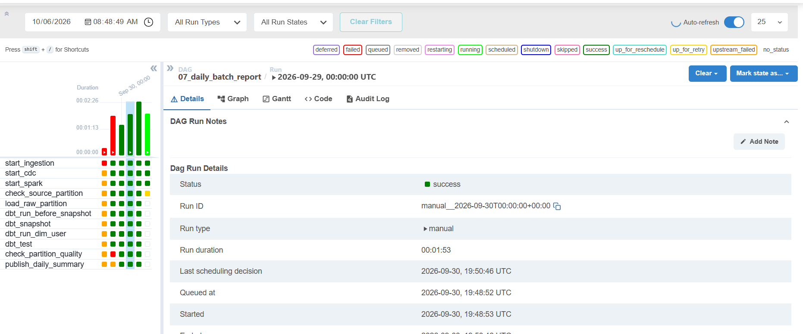
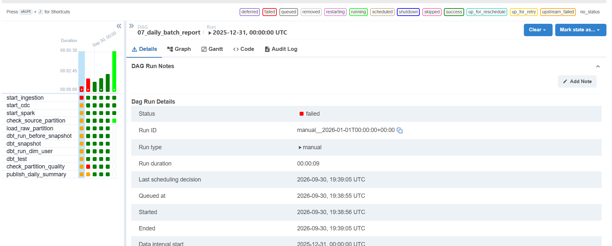

# Phase 1 evidence

Proof for the Phase 1 Definition of Done. All output below was captured
live on 2026-09-30 on the real server (`204.168.173.51`), with real
Bluesky Jetstream data flowing. The pipeline is DAG
`07_daily_batch_report`. For how to run it, see "Run the pipeline" in the
README.

## 1. Successful orchestrator run



`make pipeline` for logical date 2026-09-30. Every stage is its own task,
and all of them succeeded:

```
$ make pipeline
[run_pipeline] logical date: 2026-09-30
[run_pipeline] run for 2026-09-30 exists (failed) - clearing it to re-run
[run_pipeline] 19:33:34 state: running
[run_pipeline] 19:35:03 state: success

task_id                 | state   | start_date                       | end_date
========================+=========+==================================+=================================
start_ingestion         | success | 2026-09-30T19:33:29.485615+00:00 | 2026-09-30T19:33:29.872704+00:00
start_cdc               | success | 2026-09-30T19:33:31.182838+00:00 | 2026-09-30T19:33:31.657797+00:00
start_spark             | success | 2026-09-30T19:33:32.230344+00:00 | 2026-09-30T19:33:32.670634+00:00
check_source_partition  | success | 2026-09-30T19:33:33.920680+00:00 | 2026-09-30T19:33:36.194403+00:00
load_raw_partition      | success | 2026-09-30T19:33:37.491827+00:00 | 2026-09-30T19:33:53.658064+00:00
dbt_run_before_snapshot | success | 2026-09-30T19:33:54.602890+00:00 | 2026-09-30T19:34:14.102063+00:00
dbt_snapshot            | success | 2026-09-30T19:34:14.972726+00:00 | 2026-09-30T19:34:34.108973+00:00
dbt_run_dim_user        | success | 2026-09-30T19:34:35.218347+00:00 | 2026-09-30T19:34:39.536833+00:00
dbt_test                | success | 2026-09-30T19:34:40.981853+00:00 | 2026-09-30T19:34:52.965590+00:00
check_partition_quality | success | 2026-09-30T19:34:53.322128+00:00 | 2026-09-30T19:34:53.929994+00:00
publish_daily_summary   | success | 2026-09-30T19:34:54.363539+00:00 | 2026-09-30T19:34:54.709426+00:00

[run_pipeline] SUCCESS - run 'make smoke SMOKE_LOGICAL_DATE=2026-09-30' to verify every layer
```

(Rows are reordered by dependency, and the dag_id and execution_date columns are dropped. Airflow prints the rows in arbitrary order.)

## 2. Deliberately-failed run



The failure switch goes in the run's conf, `{"force_ingestion_failure": true}`.
`start_ingestion` raises `AirflowFailException`, so it fails immediately
with no retries. Every downstream task is `upstream_failed`, and the run
is `failed`:

```
$ make pipeline DATE=2026-01-01 ARGS=--fail
[run_pipeline] logical date: 2026-01-01
[run_pipeline] triggering with conf {"force_ingestion_failure": true}
[run_pipeline] 19:38:59 state: running
[run_pipeline] 19:39:11 state: failed

$ docker compose exec airflow-scheduler airflow tasks states-for-dag-run 07_daily_batch_report 2026-01-01
task_id                 | state
========================+================
start_ingestion         | failed
start_cdc               | upstream_failed
start_spark             | upstream_failed
check_source_partition  | upstream_failed
load_raw_partition      | upstream_failed
dbt_run_before_snapshot | upstream_failed
dbt_snapshot            | upstream_failed
dbt_run_dim_user        | upstream_failed
dbt_test                | upstream_failed
check_partition_quality | upstream_failed
publish_daily_summary   | upstream_failed
```

### A failing data quality check fails the run

`min_partition_rows` in the conf raises the threshold of the row-count
check. Everything up to `dbt_test` succeeds, then
`check_partition_quality` fails and nothing is published:

```
$ make pipeline DATE=2026-01-03 ARGS=--fail-dq
[run_pipeline] triggering with conf {"min_partition_rows": 1000000000}
[run_pipeline] 19:44:02 state: running
[run_pipeline] 19:45:56 state: failed

task_id                 | state
========================+================
start_ingestion ... dbt_test (9 tasks) | success
check_partition_quality | failed
publish_daily_summary   | upstream_failed

[run_pipeline] FAILED, as requested by the failure switch - see the task states above
```

The data quality step runs every dbt test: 42 tests, including
`not_null`/`unique` on keys and "exactly one current SCD2 row per user".
It then runs three partition checks: row count >= threshold,
`user_id_hash` not null, and `user_id_hash` unique per day. Any failure
fails the run. This also happened for real during this verification:
`assert_one_current_row_per_user` caught duplicate SCD2 rows and stopped
the run before publish (see section 8).

## 3. Row counts per layer (`make smoke`)

```
$ make smoke
tests/smoke/test_pipeline_smoke.py::test_raw_layer_has_data_for_logical_date
[smoke] raw.posts rows for 2026-09-30: 256180
PASSED
tests/smoke/test_pipeline_smoke.py::test_staging_layer_has_data_for_logical_date
[smoke] staging.stg_posts rows for 2026-09-30: 256180
PASSED
tests/smoke/test_pipeline_smoke.py::test_curated_layer_has_data_for_logical_date
[smoke] marts.fct_user_daily_activity rows for 2026-09-30: 111733, marts.mart_daily_summary rows: 1
PASSED
tests/smoke/test_pipeline_smoke.py::test_serving_layer_is_queryable_through_grafana
[smoke] Grafana /api/ds/query -> 1 row(s): [[1790726400000], [255387], [111604]]
PASSED
tests/smoke/test_pipeline_smoke.py::test_row_counts_reconcile
[smoke] row counts for 2026-09-30 -> raw.posts=256180 staging.stg_posts=256180 marts.fct_posts=256035 mart_daily_summary.total_posts=255387 (marts lag: 145 rows)
PASSED
tests/smoke/test_pipeline_smoke.py::test_orchestrator_run_succeeded
[smoke] Airflow run state of 07_daily_batch_report for 2026-09-30: success
PASSED

================================================== 6 passed in 3.32s ===================================================
```

| Layer | Object (logical date 2026-09-30) | Rows |
|---|---|---|
| raw | `raw.posts` | 256,180 |
| staging | `staging.stg_posts` (view) | 256,180 |
| curated | `marts.fct_posts` | 256,035 |
| curated | `marts.fct_user_daily_activity` | 111,733 |
| curated / serving | `marts.mart_daily_summary` | 1 (`total_posts` = 255,387) |

Why some counts differ: 2026-09-30 is today, so data keeps arriving.
- `staging` equals `raw` exactly, because it is an unfiltered view.
- `marts.fct_posts` is a table that dbt rebuilds on each run (DAG 07,
  and DAG 04 every 5 minutes). It trails `raw` by the rows that arrived
  since the last rebuild, 145 here.
- `mart_daily_summary` is the snapshot from the moment of publish, so it
  is older again.

For a closed past date these counts converge. The serving check goes
through Grafana's own datasource API, the same path the dashboard panel
"Daily batch summary" uses.

Across all five entities, the pipeline's own task logs (section 6)
reconcile source against raw: 2,142,356 rows in the source-db snapshot and
2,142,353 in raw. The difference of -3 is likes deleted after the
snapshot, and that delete was replicated through CDC.

## 4. Several logical dates, re-runs without duplicates

`make pipeline DATE=2026-09-29` also succeeded (all 11 tasks). The
2026-09-30 run was executed four times in total (the first attempt failed
on the SCD2 test, then two re-runs, then one more after the restart
below). The summary still holds exactly one row per date:

```
 report_date | rows
-------------+------
 2026-09-20  |    1
 2026-09-28  |    1
 2026-09-29  |    1
 2026-09-30  |    1
(4 rows)
```

Why a re-run cannot duplicate:
- `raw.*` is upserted on its natural primary key.
- dbt rebuilds staging and marts.
- `publish_daily_summary` uses delete-then-insert on `report_date`.

2026-01-01 and 2026-01-03 are absent on purpose: those runs failed before
publish (section 2).

## 5. Restart preserves results

`make down`, then `make up`, then `make health` ("All services are
healthy"). Every container was freshly started:

```
$ docker compose ps --format "table {{.Name}}\t{{.Status}}"
NAME                  STATUS
airflow-metadata-db   Up 5 minutes (healthy)
airflow-scheduler     Up 5 minutes (healthy)
airflow-webserver     Up 5 minutes (healthy)
dbt-docs              Up 5 minutes (healthy)
grafana               Up 5 minutes (healthy)
ingestor              Up 5 minutes (healthy)
kafka                 Up 5 minutes (healthy)
kafka-connect         Up 5 minutes (healthy)
kafka-ui              Up 5 minutes (healthy)
simulator             Up 5 minutes (healthy)
source-db             Up 5 minutes (healthy)
spark-master          Up 5 minutes (healthy)
spark-streaming       Up 5 minutes (healthy)
spark-worker          Up 5 minutes (healthy)
warehouse-db          Up 5 minutes (healthy)
```

After the restart, the four summary rows in section 4 were still there,
queried right after `make health`. The pipeline then ran again
successfully:

```
$ make pipeline
[run_pipeline] logical date: 2026-09-30
[run_pipeline] run for 2026-09-30 exists (success) - clearing it to re-run
[run_pipeline] 19:48:57 state: running
[run_pipeline] 19:50:52 state: success
... all 11 tasks success ...
```

## 6. Logging and run metadata

Each task writes a `START` line to its log with the input and output
location. It writes an `END` line with rows read, rows written and
duration. The same summary goes to `dq.pipeline_runs`. From the
post-restart run:

```
 task_id                 | status  | detail
-------------------------+---------+------------------------------------------------------------------
 publish_daily_summary   | success | input=marts.fct_user_daily_activity activity_date=2026-09-30 output=marts.mart_daily_summary report_date=2026-09-30 rows_read=112324 rows_written=1 report_date=2026-09-30
 check_partition_quality | success | input=marts.fct_user_daily_activity activity_date=2026-09-30 output=dq.pipeline_runs rows_read=112324 rows_written=None checks={'row_count>=1': True, 'user_id_hash_not_null': True, 'user_id_hash_unique_per_day': True}
 load_raw_partition      | success | input=Kafka topics bluesky.public.* (via Spark) output=warehouse-db raw.{posts,likes,reposts,follows,blocks} occurred_at::date=2026-09-30 rows_read=2142356 rows_written=2142353 per_entity={'posts': 259063, 'likes': 1467286, 'reposts': 260310, 'follows': 137877, 'blocks': 17817} difference_vs_source_snapshot=-3
 check_source_partition  | success | input=source-db public.{posts,likes,reposts,follows,blocks} occurred_at::date=2026-09-30 output=XCom (partition row counts) rows_read=2142356 rows_written=None per_entity={'posts': 259063, 'likes': 1467289, 'reposts': 260310, 'follows': 137877, 'blocks': 17817}
 start_spark             | success | input=Kafka topics bluesky.public.* output=warehouse-db raw.* rows_read=None rows_written=None control.pipeline_switches.spark_enabled=true
 start_cdc               | success | input=source-db (logical replication) output=Kafka topics bluesky.public.* rows_read=None rows_written=None connector already registered, connector=RUNNING tasks=['RUNNING']
```

For `load_raw_partition`, `rows_written` is the number of the
partition's rows present in `raw.*` once Spark has caught up past the
source snapshot. Spark itself does the writing, continuously. The dbt
tasks print each model's written row count (`SELECT n`) in their logs.

## 7. Kafka connectivity test

```
$ make kafka-test
[kafka_connectivity_test] creating throwaway topic 'connectivity-test-1790792993'...
Created topic connectivity-test-1790792993.
[kafka_connectivity_test] producing message: ping-1790792993
[kafka_connectivity_test] consuming it back...
[kafka_connectivity_test] received: ping-1790792993
[kafka_connectivity_test] PASS - message round-tripped through Kafka successfully
```

## 8. Problems found by running this for real

Each one is fixed and described in the `docs/PROJECT_PLAN.md` changelog.

- **Duplicate SCD2 rows.** On 2026-09-26, two `dbt snapshot` runs
  overlapped by 3 seconds, and 6,774 users ended up with more than one
  current row. The dbt test caught it and failed the runs. Prevention: a
  one-slot `dbt` pool shared by DAGs 04 and 07, and `max_active_runs=1` on
  DAG 04. The existing rows were repaired with
  `scripts/repair_scd2_duplicates.sql`, which keeps the history.
- **Failure switch did not work.** An environment variable passed to
  `airflow dags trigger` never reached the scheduler process that runs the
  task. It is now read from the run's conf.
- **Retries masked the forced failure.** The forced failure now raises
  `AirflowFailException`, so it fails without retrying.
- **Kafka test read an old message.** A reused topic returned a ping left
  over from an earlier run. Each run now uses a throwaway topic.
- **Smoke test expected marts to equal raw.** On a live stream they
  don't. The test now checks that marts is at most raw.
